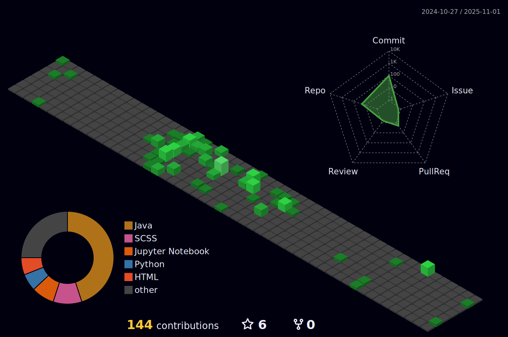

 

  

   
  
   ##

   
 
  
  

   ##
   
   

 |  |  |  
 | ----------- | ----------- |

   

 
   
  
   

 
 
 

 
  

### My range of skills:

 
 
  
  
  
  
  
  
   
  
  
  
  
  ##
  
 ### Contact:

 
  
  
   

##

  
